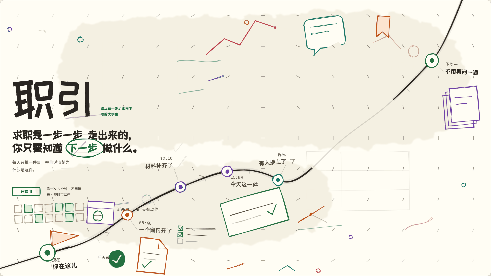
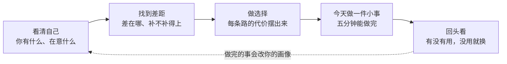
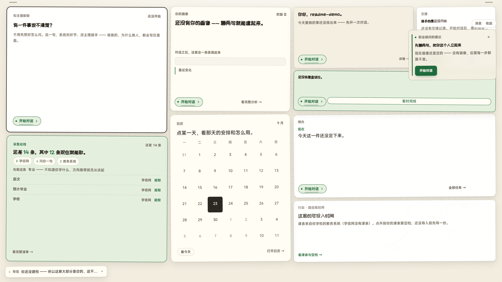
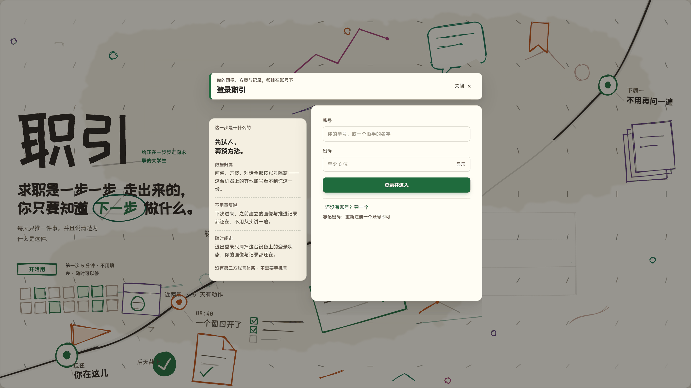

# 职引 ZHIYIN

> **求职是一步一步走出来的，你只要知道下一步做什么。**

写给正在一步步走向求职的大学生。它每天只推一件事，并说清为什么是这件。

大多数时候，你缺的不是道理，是下一步。

"先了解自己、再做规划"这句话你大概听过一百遍，可真正打开电脑那一刻，
还是不知道该从哪儿下手 —— 简历改到第七版，投出去没有回音；
别人说的每条路好像都行，又好像都不太对；道理都懂，就是动不起来。

职引就是接这个的：你把现在最烦的那件事说一句，它问你几个不用动脑的问题，
然后给你**一件今天就能做完的小事**。做完回来，它接着往下推。

不用填表，不用先注册（答到第三问才需要），第一次大概五分钟，随时可以停。

## 这些处境，它都能接住

| 你现在的情况 | 它会怎么接 |
| --- | --- |
| "我投了十几份简历，一个回音都没有，到底哪儿不对？" | 先去看这个岗位真正要什么，再告诉你差在哪几项、哪几项补得上 |
| "我根本不知道自己适合什么。" | 不从"你喜欢什么工作"问起，从你做过的事、你的能力、你在意的东西一件件问出来 |
| "几个方向都能走，我选不出来。" | 把每条路的代价摆出来对比，选哪个你说了算，选完想改随时能改 |
| "方向想清楚了，就是动不起来。" | 不给你打鸡血，把大目标拆成今天五分钟能做完的一步 |
| "我已经卡了很久，不想再被分析了。" | 先接住你，再给一个最小的动作；不追究你为什么没来 |

## 它和你用过的工具不一样在哪

- **不是给你一份长报告就走人。** 每次对话的结尾都会留下一个你能点的下一步：
  一个问题、几个选项、一件小事，或者一条提醒。只给结论不给动作，它算自己没做完。
- **不用从头再讲一遍。** 你说过的话它都记着，同一个问题不会问你第二次。
- **不要你的隐私当门票。** 不需要手机号，也不需要任何第三方账号的密码；
  学信网核验只要你去官方开一个在线验证码。
- **不替你做决定。** 它把选项和代价讲清楚，选择权始终在你手上；改主意是零成本的，
  只有受影响的那部分会重算，还会告诉你"还有哪几处跟着改"。
- **每条结论都能被盘问。** 一句话的结论、有多大把握、为什么这么判断，点开就能看。
  觉得不对可以直接说"这条不对" —— 这句话本身就是有用的反馈。
- **不装懂，也不装完整。** 还没接上的能力，它会直说"这一项还没接"；
  查不到的事就说查不到，不会编一个听起来很像真的结果给你。
- **不会没事就来找你。** 全产品只有一位"陪你推进的人"可以主动开口，
  而且有明确门槛：停了三天、同一条消息隔四十八小时、七天最多两次。
  话术不催、不施压，也不会说你"又拖了"。

## 一次求助，会经历这五步

| | 你会拿到什么 |
| --- | --- |
| 第一步 · 看清自己 | 一份写着"这条从哪来、有多大把握"的画像，还差什么它会自己列出来 |
| 第二步 · 找到差距 | 你现在有什么、目标要什么、差在哪、卡点在哪儿 |
| 第三步 · 做选择 | 主攻 / 平行 / 保底三条路，各自的匹配度和主要风险 |
| 第四步 · 今天做一件小事 | 一条带时长、带截止日期的具体动作，不是"多练习、多准备" |
| 第五步 · 回头看 | 做过的事有没有用；没用就改，不会把停滞怪到你头上 |

五步不是一条必须从头走的流水线：你可以从任意一步进来，前面攒下的东西会自己接上，
中途退出也不会丢进度。

## 界面上你看到的是这些

- **今天**：一屏之内就是你现在能动的事。哪几块在前、哪几块先收起来，由它按你的情况安排，你也能拖着挪。
- **你的画像**：每条都写着从哪来、有多大把握，不确定的地方会列成"还没问到的"。
- **报告**：结论可以一条条点开看依据，也能看这一版和上一版差在哪。
- **日历与待办**：关键截止日、这周的空档、你自己写的和它建议的，分得清清楚楚。
- **记录只认做过的事**：完成的那枚印章来自你真做了一件，不靠签到、不靠多开几次页面。

第一天的界面大部分是空的，这不是坏了 —— 先聊两句，后面每一步才有得算。

## 凭什么信它

- **背后是一整套职业咨询的方法**：兴趣类型、能力三核、三叶草、决策平衡单……
  每一步用了哪一套，点开就能看到。
- **外部事实都带来源**：岗位要求、行情、时间窗口这类信息，点得回原页面。
- **你的信息只用来给你自己出结果**：用来生成你自己的报告、方案和计划，
  不用于对外投放。
- **能随时走**：退出登录只清掉这台设备上的登录状态，你的画像和记录都还在。

## 想试的话，这样开始

1. 打开它，从七句话里挑一句最像你的 —— "还不太清楚自己适合什么""想验证某个方向行不行""几个方向拿不准"……
2. 回答几个不用动脑的问题。答到第三问才需要登录，登录后原地接着答，答过的不重来。
3. 拿到一件今天能做的小事，做完把它勾掉。

第一次大概五分钟，不用填表，随时可以停。

## 常见问题

| 问题 | 回答 |
| --- | --- |
| 我该从哪里开始？ | 从首页选一句最像你现在的处境的话，它会判断该从哪一步接，并让对应的主理先问你一个问题。 |
| 我填的信息会被怎么用？ | 只用来生成你自己的报告、方案与计划，不用于对外投放；不需要手机号，也不需要任何第三方账号的密码。 |
| 中途退出会丢进度吗？ | 不会。下次进来会从你停下的那一步接着走，已经确认过的信息不再问第二遍。 |
| 为什么有时候换了一个人在回答？ | 走到不同阶段，接手的人会变。按规矩，换人必须先说明：谁接手、依据哪套方法、为什么换。 |
| 这些结论准吗？ | 每条结论都写着它的依据和把握程度，点开就能核对；你觉得不对可以直接否决，否决也会被记下来。 |

---

这一页介绍的是产品本身。设计和实现的口径在这儿，给继续做这个产品的人： 
[产品设计文档](docs/职引-完整设计文档.md) —— 产品与业务的唯一事实来源，最后那节是「客户演示操作流程」；
[上线与搬家](deploy/部署说明.md)；
[修改记录](CHANGELOG.md)。

